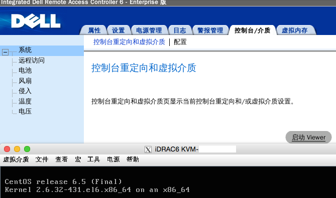

# Why do I need Firefox with Java plugin in Docker?

iDRAC, all because iDRAC. I couldn't smoothly remote connect to my DELL machine console on mac. So I dockerize it.

# Usage

Install docker/X Window on Mac

    brew install socat docker docker-machine
    brew cask install xquartz

start your docker vm

    docker-machine create --driver virtualbox dev
    eval "$(docker-machine env dev)"

run firefox-java container

    # VBOXNET_IP is your vboxnetX's IP on your mac
    VBOXNET_IP=192.168.99.1
    socat TCP-LISTEN:6000,bind=${VBOXNET_IP},reuseaddr,fork UNIX-CLIENT:\"$DISPLAY\"
    docker run -it --rm -e DISPLAY=${VBOXNET_IP}:0 cmaohuang/firefox-java

It works!!!

# Issue

use oracle-java8 will occur "JVMLauncher.afterStart(): starting JVM process watcher" InterruptedException

    RUN echo "deb http://ppa.launchpad.net/webupd8team/java/ubuntu trusty main" > /etc/apt/sources.list.d/OracleJava.list && \
    echo oracle-java8-installer shared/accepted-oracle-license-v1-1 select true | debconf-set-selections && \
    apt-key adv --keyserver keyserver.ubuntu.com --recv-keys EEA14886 && \
    apt-get update && DEBIAN_FRONTEND=noninteractive apt-get install -y oracle-java8-installer oracle-java8-set-default

    RUN DEBIAN_FRONTEND=noninteractive apt-get install -y dbus dbus-x11 && \
    dbus-uuidgen > /var/lib/dbus/machine-id

# Reference

* [Running GUI apps with Docker](http://fabiorehm.com/blog/2014/09/11/running-gui-apps-with-docker/)
* [khozzy/docker](https://github.com/khozzy/docker/blob/master/selenium_java_firefox/Dockerfile)
* [how to use -e DISPLAY flag on osx?](https://github.com/docker/docker/issues/8710)
